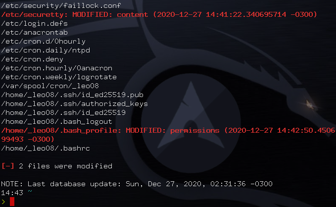

# SIDS
> A lightweight and simple HIDS (Host-based Intrusion Detection System) written in Bash

Example image of a `sids` check output.

## Description

`SIDS` creates a database of files (with the `-i` option) specified in the configuration file. This database stores hashes, permissions, and ownership data for each monitored file. Later, via the `-c` option, it checks the current status of each monitored file against the data stored in the database. If something does not match, `sids` will let you know, as shown in the image above.

## What is different than the original Leo-arch/sids?

The original project was sending the notifications via terminal if there was a change on the watched directory. Now;

* The notification is being sent via E-mail.
* Notification now has the logs about which changes were made.
* Notifications are being sent when someone with admin privilege tries to access the directory.
* Currently the project watches the directory every 1 minute.
* You can change the watched directory, email info, and how often it should compare the databases in sids script.
